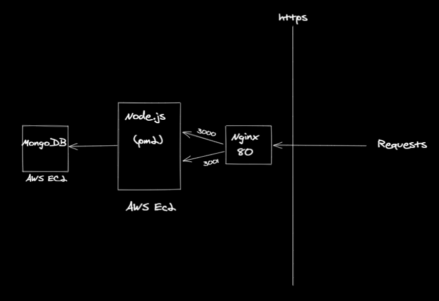
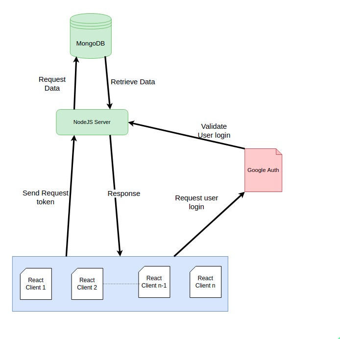
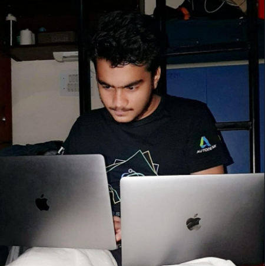

<p align="center"><a href="https://www.codechefvit.com" target="_blank"></a>
</p>

# Consilio Backend

> Backend for CodeChefVIT's Design Hackathon Consilio


---
[](https://documenter.getpostman.com/view/10014129/TzCHAV4C#96e615de-c5c4-4599-8e91-ae4c509c3717) 
  [](https://designwith.codechefvit.com/)
  
## Features
- Insert list of features here

## Architecture 
<br />



## Instructions to run
```
$ git clone https://github.com/CodeChefVIT/Consilio-Backend.git
$ cd Consilio-Backend
>> Refer .env.example for environment variables
$ npm install
$ node app.js
```
## Contributors
<table>
  <tr>
    <td align="center"><a href="https://github.com/N0v0cain3"><br /><sub><b>Shivam Mehta</b></sub></a><br /> </td>
      <td align="center"><a href="https://github.com/jugaldb"><br /><sub><b>Jugal Bhatt</b></sub></a><br /> </td></td>
   
   
  </tr>
  </table>

## License
[](https://opensource.org/licenses/MIT)


<p align="center">
	With :heart: by <a href="https://www.codechefvit.com" target="_blank">CodeChef-VIT</a>
</p>
